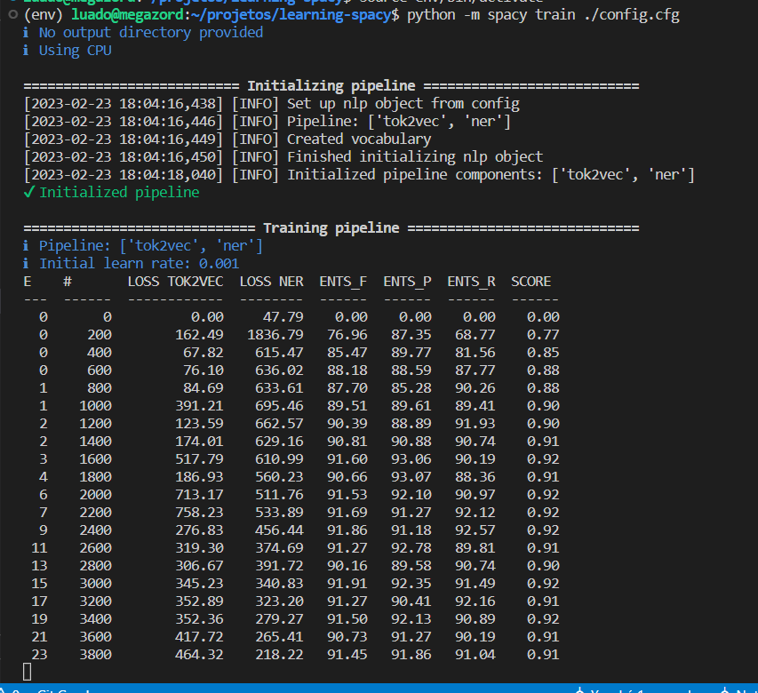

# Information about the project

Python 3.8.10 was the python version used in this project.  
Use the requirements.txt file for the other dependencies needed.  
Load the dependencies in a python environment with:  
```
python -m venv env
source ./env/bin/activate
pip install -r requirements.txt
```
Running the commands above after installing python 3.8.10 should assure everything runs smoothly.

# About running this project
After installing the right version of python and the requirements from `requirements.txt` as stated above,
activate the virtual environment with `source env/bin/activate`,
then you can run the build_doc_bins.py with `python src/build_doc_bins.py`.  
After running the above command, the spacy `doc_bins` will have been generated, then you can run the training command to train the model with the `doc_bins`: `python -m spacy train ./config.cfg`  
The result meaning the trained model will be stored in the `target` folder.
After this you can run `python src/using_trained_model.py` to see the result given by the trained model.

# How the training configuration file was generated
```
python -m spacy init config ./config.cfg --lang en --pipeline ner
```
## Explaining the command:
The command `python -m spacy init config` takes one argument, the path to where the config file will be generated.  
Here, 2 flags were used as well, the `--lang`, to specify the configuration file language, and the `--pipeline` to specify which allows you to specify a comma separated list of pipeline components that will be targeted for the training. In this case, there is only one being specified, which is the NamedEntityRecofnition component.  

# Training a pipeline
To train a pipeline, run the following
```
python -m spacy train ./config.cfg --output ./target --paths.train doc_bins/train.doc_bin.spacy --paths.dev dev.doc_bin.spacy
```
The `--output` flag specify the place where the trained model will be saved.  
The `--paths.train` flag specify the training data file. 
The `--paths.dev` flag specify the test data file. 


# The project_images folder.
This folder was created only to house eventual images that I deemed worth to be placed within the repository.  
A example is the figure showing the training output, to illustrate what kind of output the user should be expecting.

# Loading and using the trained pipeline.
The output of the training will be a regular loadable Spacy pipeline.  
`model-last`: is the last trained pipeline.  
`model-best`: The best trained pipeline.  

```
import spacy

nlp = spacy.load("/path/to/output/model-best")
doc = nlp("iPhone 11 vs iPhone 8: What's the difference?")
print(doc.ents)
```

# Interpreting the output of the trained model:

[Meaning of NER Training Values](https://datascience.stackexchange.com/questions/103062/meaning-of-ner-training-values-using-spacy)  

Example of the output after training a model:  
  

